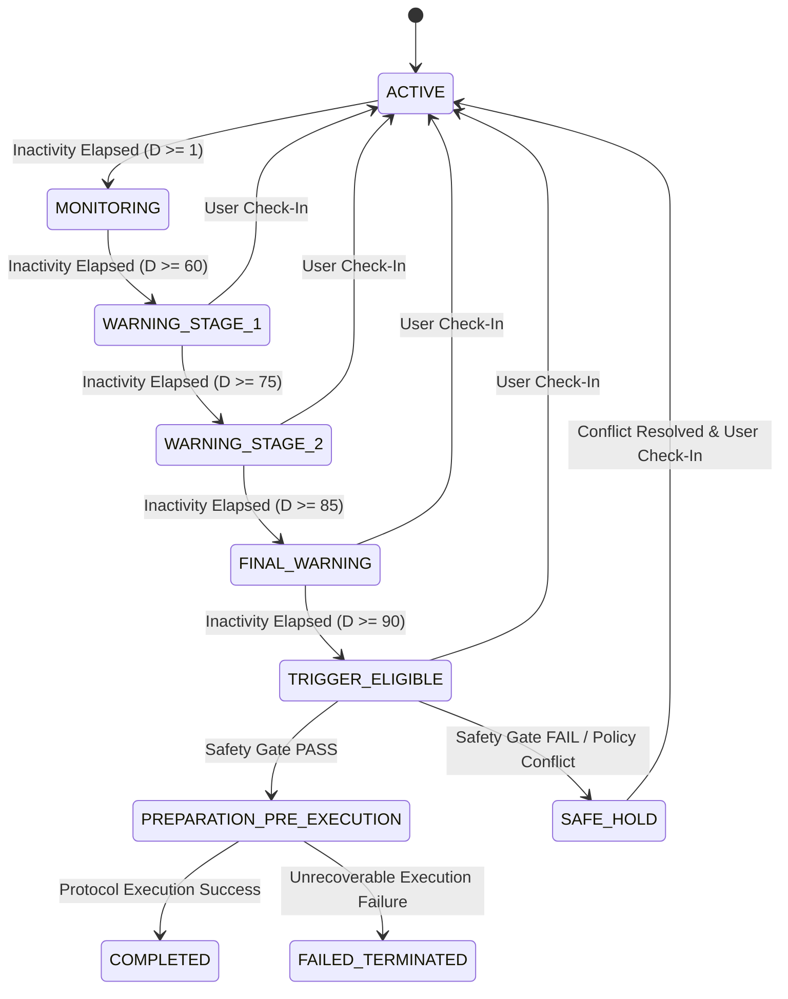

# DataDignity — Inactivity & State Machine Specification

This document provides the formal implementation-oriented specification for DataDignity's inactivity state machine, liveness evaluation model, warning window schedules, cancellation mechanics, pre-execution safety gates, and conflict resolution rules (`SAFE HOLD`).

---

## 1. Purpose and Scope

DataDignity manages post-mortem privacy and digital estate actions, including data recovery via the Legacy Protocol and third-party data erasure via the Scrub Protocol. Because these actions carry irreversible consequences, the system requires a deterministic, auditable, and fail-closed state machine.

This specification governs all state transitions from normal user activity through inactivity monitoring, staged warnings, eligibility evaluation, safety gates, cancellation, and execution readiness across backend cron services, database state engines, and API controllers.

---

## 2. Core Lifecycle States

```
+---------------------------------------------------------------------------------+
|                                 ACTIVE / HEALTHY                                |
|   (User actively checking in; last_liveness_at within normal threshold window)  |
+----------------------------------------+----------------------------------------+
                                         |
                                         | Inactivity Threshold Elapsed (Day 60)
                                         v
+---------------------------------------------------------------------------------+
|                                WARNING STAGE 1                                  |
|   (Day 60-74: First notification dispatched to user; timer active)              |
+----------------------------------------+----------------------------------------+
                                         |
                                         | Inactivity Elapsed (Day 75)
                                         v
+---------------------------------------------------------------------------------+
|                                WARNING STAGE 2                                  |
|   (Day 75-84: Urgent user notification; initial alert to Trusted Contact)      |
+----------------------------------------+----------------------------------------+
                                         |
                                         | Inactivity Elapsed (Day 85)
                                         v
+---------------------------------------------------------------------------------+
|                                 FINAL WARNING                                   |
|   (Day 85-89: Final warning to user; escalated alert to Trusted Contact)        |
+----------------------------------------+----------------------------------------+
                                         |
                                         | Inactivity Elapsed (Day 90+)
                                         v
+---------------------------------------------------------------------------------+
|                                TRIGGER ELIGIBLE                                 |
|   (Account eligible for Final Safety Gate evaluation; no automated execution)   |
+----------------------------------------+----------------------------------------+
                                         |
                                         | Final Safety Gate Passed
                                         v
+---------------------------------------------------------------------------------+
|                             PREPARATION / PRE-EXECUTION                         |
|   (Payload packages compiled or erasure requests queued under atomic locks)     |
+----------------------------------------+----------------------------------------+
                                         |
                                         | Protocol Pipelines Executed
                                         v
+---------------------------------------------------------------------------------+
|                                   COMPLETED                                     |
|   (Legacy payload delivered or Scrub erasure confirmed; immutable audit log)    |
+---------------------------------------------------------------------------------+
```

### State Definitions

1. **`ACTIVE`**: Account is healthy. User has provided a valid check-in signal within normal operating parameters.
2. **`MONITORING`**: Account is under active background monitoring. Inactivity duration is between Day 1 and Day 59.
3. **`WARNING_STAGE_1`**: Inactivity duration $\ge 60$ days and $< 75$ days. Initial warning notification dispatched to user.
4. **`WARNING_STAGE_2`**: Inactivity duration $\ge 75$ days and $< 85$ days. Urgent warning dispatched to user; notification sent to designated Trusted Contact.
5. **`FINAL_WARNING`**: Inactivity duration $\ge 85$ days and $< 90$ days. Final warning dispatched to user; escalation alert sent to Trusted Contact.
6. **`TRIGGER_ELIGIBLE`**: Inactivity duration $\ge 90$ days. Account becomes eligible for Final Safety Gate evaluation. *Note: Trigger eligibility does NOT automatically execute irreversible actions.*
7. **`SAFE_HOLD`**: Protective lock state triggered by policy conflicts, unverified beneficiary public keys, missing authorization, or system integrity failures. Automated execution is strictly suspended.
8. **`CANCELLED_REACTIVATED`**: Transient state logged when a user provides an active check-in during warning or eligibility stages. Account immediately returns to `ACTIVE`.
9. **`PREPARATION_PRE_EXECUTION`**: Final Safety Gate passed. Execution locks acquired; payload packages compiled or erasure API requests queued.
10. **`COMPLETED`**: Protocol execution (`LEGACY` delivery or `SCRUB` third-party erasure) confirmed complete.
11. **`FAILED_TERMINATED`**: Execution failed due to unrecoverable errors (e.g., missing beneficiary keys, API revocation, or provider refusal). Flagged for manual audit.

---

## 3. State Transition Matrix

| Current State | Trigger / Event | Required Checks & Conditions | Next State | Side Effects | Reversible? |
|---|---|---|---|---|---|
| **`ACTIVE`** | $D \ge 1$ day | Inactivity timer running | **`MONITORING`** | Background tracking enabled | Yes |
| **`MONITORING`** | $D \ge 60$ days | No check-in received | **`WARNING_STAGE_1`** | Dispatch User Warning Email #1 | Yes |
| **`WARNING_STAGE_1`** | $D \ge 75$ days | No check-in received | **`WARNING_STAGE_2`** | Dispatch Urgent Email #2; Alert Trusted Contact | Yes |
| **`WARNING_STAGE_2`** | $D \ge 85$ days | No check-in received | **`FINAL_WARNING`** | Dispatch Final Warning Email #3; Escalate Trusted Contact | Yes |
| **`FINAL_WARNING`** | $D \ge 90$ days | No check-in received | **`TRIGGER_ELIGIBLE`** | Mark account eligible for Final Safety Gate evaluation | Yes |
| **`TRIGGER_ELIGIBLE`** | Final Safety Gate `PASS` | All 9 safety checks satisfied | **`PREPARATION_PRE_EXECUTION`** | Acquire distributed row locks; compile payload tasks | No |
| **`TRIGGER_ELIGIBLE`** | Safety Check `FAIL` | Policy conflict or unverified key | **`SAFE_HOLD`** | Lock workflow; alert user/admin; suspend automation | Yes (Manual) |
| **Any Warning State** | User Check-In | Valid user authentication | **`ACTIVE`** | Reset $T_{\text{last}}$; cancel pending warning notifications | Yes |
| **`SAFE_HOLD`** | User Conflict Resolution | Manual policy fix / key verification | **`MONITORING`** or **`ACTIVE`** | Release lock; re-evaluate state machine | Yes |
| **`PREPARATION`** | Protocol Success | Payload delivered / Scrub confirmed | **`COMPLETED`** | Record immutable audit entry; update asset status | No |
| **`PREPARATION`** | Protocol Failure | Provider outage / Delivery error | **`FAILED_TERMINATED`** | Log error state; notify trusted contact/user | Manual |

### Invalid Transitions (Forbidden)
- Direct transition from `ACTIVE` or `MONITORING` to `TRIGGER_ELIGIBLE` without traversing warning windows.
- Transition from `SAFE_HOLD` directly to `PREPARATION_PRE_EXECUTION` without passing safety gates.
- Transition from `COMPLETED` back to `ACTIVE` for executed irreversible actions (e.g. third-party data erasure).
- Execution of `UNCLASSIFIED` assets under any circumstance.

---

## 4. Liveness Model & Signal Hierarchy

DataDignity enforces a strict hierarchy between primary liveness signals and secondary corroboration.

```
                  +---------------------------------------------------+
                  |         PRIMARY LIVENESS SIGNAL                   |
                  |  Explicit User Check-In (Manual UI / API)        |
                  |  - SOLE signal that resets inactivity timer       |
                  |  - Instantly cancels warning stages & SAFE HOLD   |
                  +-------------------------+-------------------------+
                                            |
                                            | Authoritative Reset
                                            v
                  +---------------------------------------------------+
                  |       SECONDARY OAUTH CORROBORATION (Optional)    |
                  |  GitHub, Google Workspace, LinkedIn API Activity  |
                  |  - Provides non-binding activity timestamps       |
                  |  - DOES NOT reset primary check-in timer          |
                  |  - Provider outage MUST NOT imply user death      |
                  +---------------------------------------------------+
```

### Signal Rules
1. **Primary Liveness Signal**: Explicit, user-authenticated check-in assertion via the DataDignity interface or authenticated API. This is the **ONLY** signal that resets the primary inactivity timer ($T_{\text{last}}$).
2. **Secondary OAuth Corroboration**: Activity queried from linked OAuth providers (e.g. GitHub commits, Google Workspace logins). Serves as secondary evidence to prevent false warnings.
3. **Provider Outage Rule**: Expired OAuth tokens, revoked API access, or provider network outages MUST NEVER be interpreted as user inactivity or legal death.
4. **Signal Timestamp Normalization**: All incoming liveness assertions are recorded in UTC (ISO 8601 format). Duplicate assertions within a 24-hour window are deduplicated.

---

## 5. Inactivity Calculation

Inactivity duration $D$ is calculated in days during each scheduled cron evaluation run:

$$D = \left\lfloor \frac{T_{\text{ref}} - T_{\text{last}}}{86,400,000} \right\rfloor \text{ (days)}$$

- **$T_{\text{ref}}$**: Current UTC timestamp of the cron evaluation worker.
- **$T_{\text{last}}$**: UTC timestamp of the user's latest verified primary check-in assertion.
- **Timezone Normalization**: All timestamps are converted to UTC before calculation to eliminate local timezone offsets.
- **Clock Skew Tolerance**: Evaluation engine accepts a clock skew margin of up to $\pm 300$ seconds between distributed workers.
- **Non-Resetting Actions**: Passive profile views, background API queries, email opens, or failed login attempts **DO NOT** reset $T_{\text{last}}$.

> [!IMPORTANT]
> **DECISION REQUIRED — Secondary OAuth Delay Window**:
> Whether secondary OAuth activity (e.g., verified GitHub commit within 7 days) can defer automated transition from `WARNING_STAGE_1` to `WARNING_STAGE_2` by up to 14 days without resetting $T_{\text{last}}$.
> *Status*: `DECISION REQUIRED`. Recommendation: Allow secondary OAuth corroboration to extend Warning Stage 1 by a maximum of 14 days, but require a primary check-in to reset $T_{\text{last}}$.

---

## 6. Warning Window Specifications

DataDignity enforces a mandatory multi-stage warning schedule prior to trigger eligibility.

```
Day 0                Day 60              Day 75              Day 85             Day 90+
  │                    │                   │                   │                  │
  ├── MONITORING ─────►├── WARNING STAGE 1►├── WARNING STAGE 2►├── FINAL WARNING ─►├── TRIGGER ELIGIBLE
  │   (Normal State)   │   (User Email #1) │   (User Email #2  │   (Final Email   │   (Final Safety
  │                    │                   │    + Trusted      │    + Escalated   │    Gate Evaluation)
  │                    │                   │    Contact Alert) │    Alert)        │
```

- **Day 60 (Warning Stage 1)**: Triggered at $D \ge 60$. Dispatches initial warning email to user. Explains that inactivity has reached 60 days and provides a single-click check-in link.
- **Day 75 (Warning Stage 2)**: Triggered at $D \ge 75$. Dispatches urgent warning email/SMS to user. Sends initial informational notification to designated Trusted Contact.
- **Day 85 (Final Warning)**: Triggered at $D \ge 85$. Dispatches final urgent notification to user. Dispatches escalated notification to Trusted Contact emphasizing that trigger eligibility approaches in 5 days.
- **Day 90+ (Trigger Eligibility)**: Triggered at $D \ge 90$. Account state advances to `TRIGGER_ELIGIBLE`. The system initiates the Final Safety Gate evaluation. **No irreversible delivery or deletion occurs without passing all safety gate checks.**

---

## 7. Cancellation and Reactivation Mechanics

User check-in and account reactivation take absolute precedence over automated inactivity timers.

1. **Reactivation Trigger**: The user logs in and submits an authenticated check-in assertion.
2. **State Reset**:
   - $T_{\text{last}}$ updated to $T_{\text{current}}$.
   - Account state machine transitions from `WARNING_STAGE_X` or `TRIGGER_ELIGIBLE` back to `ACTIVE`.
   - All pending warning notifications and queued background jobs are cancelled immediately.
3. **Reversibility Boundary**: If a protocol action has already reached `COMPLETED` status (e.g., third-party data erasure confirmed under Scrub Protocol), reactivation resets the account state machine but cannot magically restore externally purged third-party data.

---

## 8. Trusted Contact Role & Boundaries

The Trusted Contact acts strictly as a human escalation channel during warning stages.

- **Notification Schedule**: Notified at Day 75 (initial warning) and Day 85 (final escalation).
- **Information Shared**: Receives only basic alert metadata (e.g., "User [Name] has been inactive on DataDignity for 75 days").
- **Forbidden Data**: Trusted Contacts **NEVER** receive raw ciphertext, DEKs, master passphrases, or beneficiary key packages.
- **Action Capabilities**: Trusted Contacts can attempt to contact the user offline. They possess **NO** legal executor authority and **CANNOT** trigger, delay, or cancel protocols on the user's behalf.
- **Legal Limitation**: Trusted contact notification or acknowledgement does **NOT** constitute legal proof of death or probate authorization.

---

## 9. Final Eligibility Safety Gate

Before any asset transitions from `TRIGGER_ELIGIBLE` to `PREPARATION_PRE_EXECUTION`, it must pass all 9 checks of the Final Eligibility Gate (`EvaluateFinalEligibility()`):

```
+---------------------------------------------------------------------------------+
|                       FINAL ELIGIBILITY SAFETY GATE CHECKLIST                   |
+---------------------------------------------------------------------------------+
  [ ] Check 1: Inactivity Threshold Breached (D >= 90 days)
  [ ] Check 2: Full Warning Sequence Completed (Day 60, 75, 85 notifications sent)
  [ ] Check 3: No Active Cancellation or Recent Check-In Asserted
  [ ] Check 4: Asset Policy Explicitly Classified (LEGACY or SCRUB)
  [ ] Check 5: No Policy Conflict (Asset NOT marked both LEGACY and SCRUB)
  [ ] Check 6: For LEGACY: Beneficiary keys Present, VERIFIED & Wrapped DEKs Valid
  [ ] Check 7: For SCRUB: Target API Authorization Valid & Provider AVAILABLE
  [ ] Check 8: Asset NOT Currently Locked in SAFE_HOLD
  [ ] Check 9: System Integrity & Cryptographic Tag Checks PASS
+----------------------------------------+----------------------------------------+
                                         |
                                         +---> ALL PASS: Advance to PREPARATION
                                         |
                                         +---> ANY FAIL: Force to SAFE_HOLD
```

> **Separation Requirement**: `ELIGIBLE_FOR_EXECUTION` evaluates safety conditions. `ACTUALLY_EXECUTED` invokes protocol delivery/erasure pipelines after approval. Eligibility evaluation does not itself alter payload data.

---

## 10. SAFE HOLD Protective State

`SAFE_HOLD` is a protective lock state that halts automated processing when safety conditions are ambiguous or violated.

### SAFE HOLD Triggers
- Asset policy conflict (e.g., asset tagged for both `LEGACY` and `SCRUB`).
- Asset policy is `UNCLASSIFIED`.
- Beneficiary public key is `UNVERIFIED` or missing wrapped DEK.
- OAuth token revoked or target API provider outage during Scrub evaluation.
- Cryptographic authentication tag check failure or corrupted ciphertext.
- Concurrency lock contention or interrupted state transition.

### Resolution
An asset in `SAFE_HOLD` remains locked until the user explicitly resolves the underlying conflict (e.g. updating policy classification or verifying beneficiary fingerprints). Automated scripts can **NEVER** resolve a `SAFE_HOLD` state.

---

## 11. Idempotency & Duplicate Execution Guards

To prevent duplicate data delivery, repeated deletion calls, or notification storms:

1. **Unique Execution ID**: Every evaluation and protocol execution run receives a unique `execution_id` (UUIDv4).
2. **Distributed Locks**: Background cron workers acquire atomic Redis/database row locks (`SELECT FOR UPDATE NOWAIT`) on the target asset before evaluation.
3. **Atomic State Commit**: Database updates execute within atomic transactions (`PRISMA $transaction`).
4. **Idempotent API Connectors**: Scrub Protocol connectors check `erasure_status` before calling third-party APIs. Re-running a completed job returns the cached result without duplicate API calls.

---

## 12. Failure and Recovery Matrix

| Failure Mode | System Behavior | Recovery Action |
|---|---|---|
| **Cron Worker Crash** | Atomic database transaction rolls back; row lock released. | Next scheduled cron run re-evaluates state safely. |
| **Notification Gateway Outage** | Notification marked `FAILED_RETRYING`. | Retries with exponential backoff (max 3 attempts) before placing job in `SAFE_HOLD`. |
| **Database Disconnection** | Engine fails closed. No state transitions occur. | Cron halts; state machine resumes when DB reconnects. |
| **OAuth Provider Outage** | Provider status set to `PROVIDER_UNAVAILABLE`. | Secondary liveness check skipped; does NOT advance inactivity timer. |
| **Scrub Third-Party API Failure** | Status recorded as `DELETION_FAILED` or `DELETION_UNAVAILABLE`. | Retries via background queue; does NOT report deletion as confirmed. |
| **Interrupted Execution** | Asset retains `PREPARATION` or `SAFE_HOLD` state. | Admin audit log generated; safe retry from checkpoint. |

---

## 13. Concurrency & Race Condition Protections

1. **User Check-In vs Cron Evaluation**: User check-in acquires an immediate atomic row lock, updates $T_{\text{last}}$, and sets state to `ACTIVE`. If a cron worker evaluates the same user concurrently, its `WHERE state != 'ACTIVE'` check fails and the cron transition aborts.
2. **User Cancellation vs Protocol Preparation**: Final execution transaction verifies `is_cancelled == false` inside the atomic `$transaction` block immediately before dispatching payloads.
3. **Beneficiary Revocation vs Legacy Execution**: Revoking a beneficiary triggers DEK rotation, invalidating old wrapped DEKs before the Legacy delivery phase commits.
4. **Concurrent Worker Execution**: Database row locking ensures exactly one cron worker processes a given asset at any time.

---

## 14. Auditability Specifications

All state machine transitions generate immutable audit ledger entries containing:

```json
{
  "log_id": "log_8f3a9c12_20260918",
  "timestamp_utc": "2026-09-18T13:00:00Z",
  "tenant_id": "usr_99812",
  "asset_id": "vlt_44102",
  "previous_state": "WARNING_STAGE_2",
  "new_state": "FINAL_WARNING",
  "transition_trigger": "INACTIVITY_TIMER_DAY_85",
  "actor_type": "SYSTEM_CRON_WORKER",
  "execution_id": "exec_77192_abc",
  "status": "SUCCESS"
}
```

> **Zero-Knowledge Audit Boundary**: Audit logs strictly record state names, timestamps, and execution IDs. Plaintext asset payloads, DEKs, passphrases, and private keys are **NEVER** written to audit logs.

---

## 15. Security Requirements Summary

1. **Fail-Closed Design**: Any ambiguous state, missing key, or API failure forces the system into `SAFE_HOLD`.
2. **Explicit Final Safety Gate**: Irreversible actions require passing all 9 safety gate checks.
3. **Cancellation Precedence**: User check-in overrides all automated timers and cancels pending triggers.
4. **Non-Proof-of-Death Boundary**: Inactivity detection is a technical signal only and does not establish legal proof of death.
5. **Idempotency & Lock Protection**: All transitions use atomic transactions and distributed locks to prevent duplicate execution.
6. **Policy Protection**: `UNCLASSIFIED` assets remain untouched; policy conflicts enter `SAFE_HOLD`.

---

## 16. Formal State Transition Diagram



---

## 17. Implementation Boundary

- **CURRENTLY SPECIFIED**: Core states, transition matrix, liveness hierarchy, warning window schedules (Day 60, 75, 85, 90+), cancellation mechanics, trusted contact role, final eligibility safety gate, `SAFE_HOLD` triggers, idempotency rules, concurrency locking, and audit requirements (documented in this file).
- **NOT YET IMPLEMENTED**: Inactivity evaluation cron jobs (`backend/jobs/inactivity-cron.js`), liveness API routes (`backend/routes/liveness.js`), warning notification queues, OAuth activity polling, Legacy Protocol delivery (`backend/protocols/legacy.js`), and Scrub Protocol connectors (`backend/protocols/scrub.js`) will be built in **Phase 5 (Liveness & Check-In)**, **Phase 6 (Warning System & Cron Engine)**, **Phase 8 (Legacy Protocol)**, and **Phase 9 (Scrub Protocol)**.
